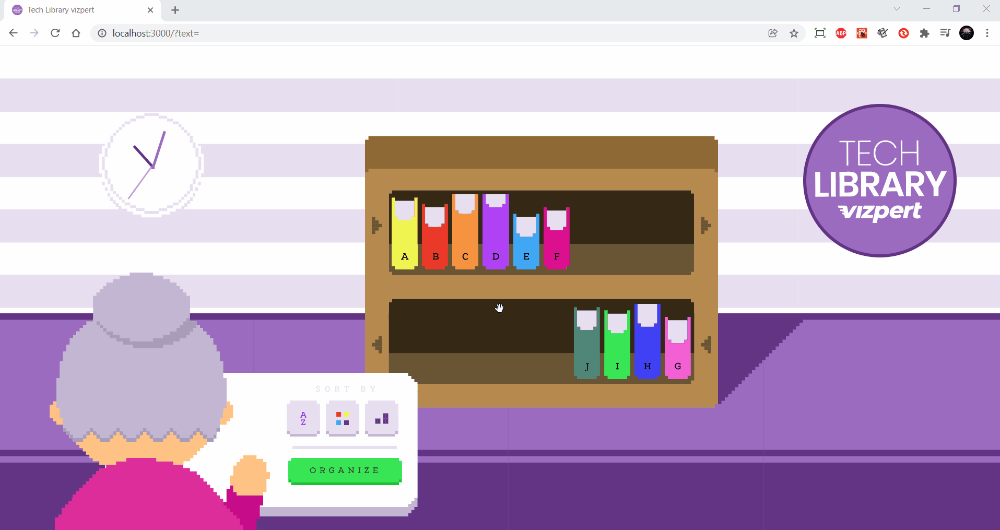

# TECH LIBRABRY Vizpert

## Funcionalidades:

### `Movimentar`
É possível mover o livro dentro da sua propria prateleira.

### `Ordernar`
Existem três tipos de botões cada um deles ordernar o livros presentes em ordem alfabética, por cor e tamanho.

### `Atualizar livro`
Ao clicar duas vezes no mesmo livro e possivel o mudar para outro livro.

### `Adicionar ou remover livro`
Cada prateleira possui duas setas uma adiciona um novo livro a coleção conforme a quantidade da outra pratileira, e a  outra seta o remove o livro.

### `Relógio`
Relógio pega a hora atual.

## Desktop

## Mobile

## Tecnologias
### `HTML5`
### `CSS3`
### `JavaScript`
### `jQuery`
### `React JS`
### `React-beautiful-dnd`
